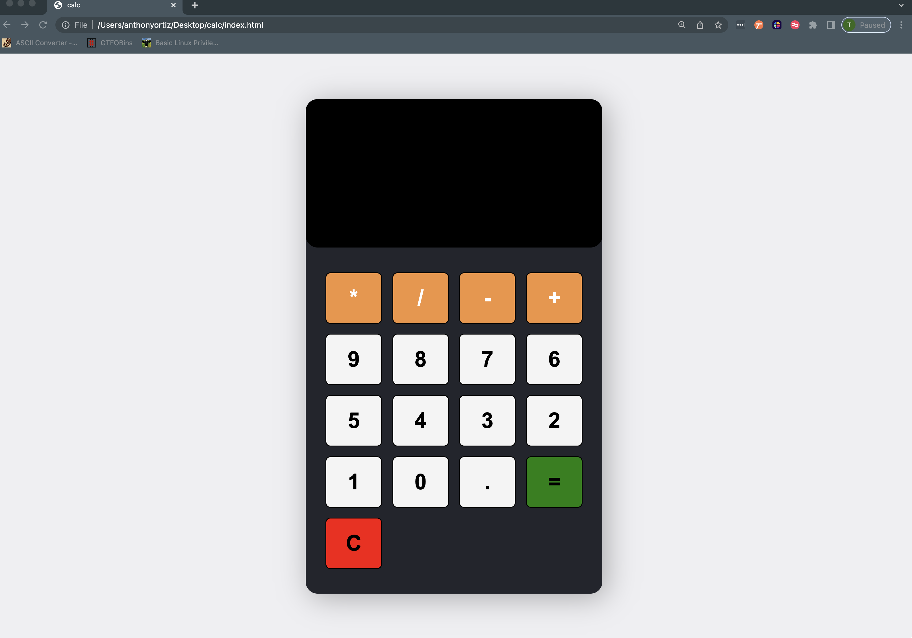

# Calculator with vanilla JavaScript
I want to practice vanilla JS more before starting a framwork like React and Node.

### Afterthoughts: 
- Our selection class was the entire calculator project. Inside this we had TWO main elements (1.) the screen - input type=“screen” and (2.) the buttons - div class=“buttons”.
- Within our buttons, we had FOUR separate classes: (1.) yellow , (2.) grey , (3.) green, and (4.) red - green and red buttons had additional functionality. 
- Tags - the difference between class and type?
- Attribute data-num prints character that is set when button is click.

